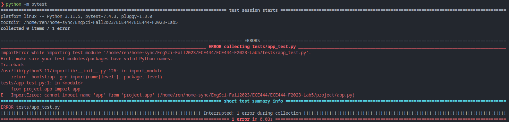
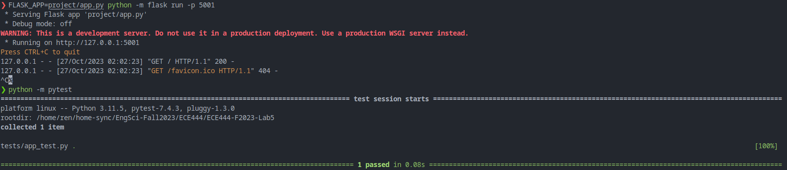
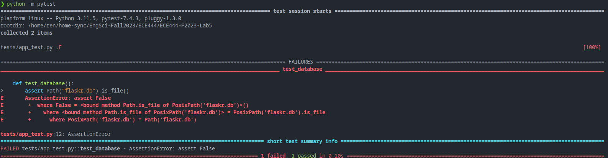
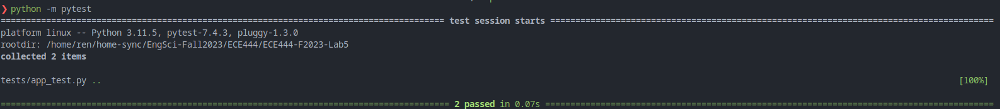
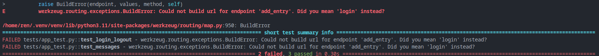
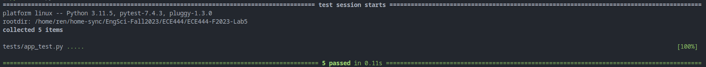
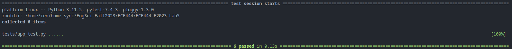
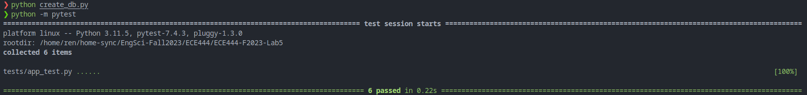
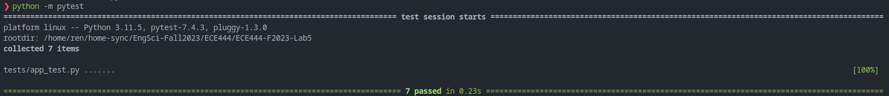

# ECE444-F2023-Lab5

# First Test

# Database Tests

# Templates and Views + Login Tests

# JavaScript Implementation Tests

# SQLAlchemy Tests

# Login Required Final Test

# Pros and Cons of TDD

TODO